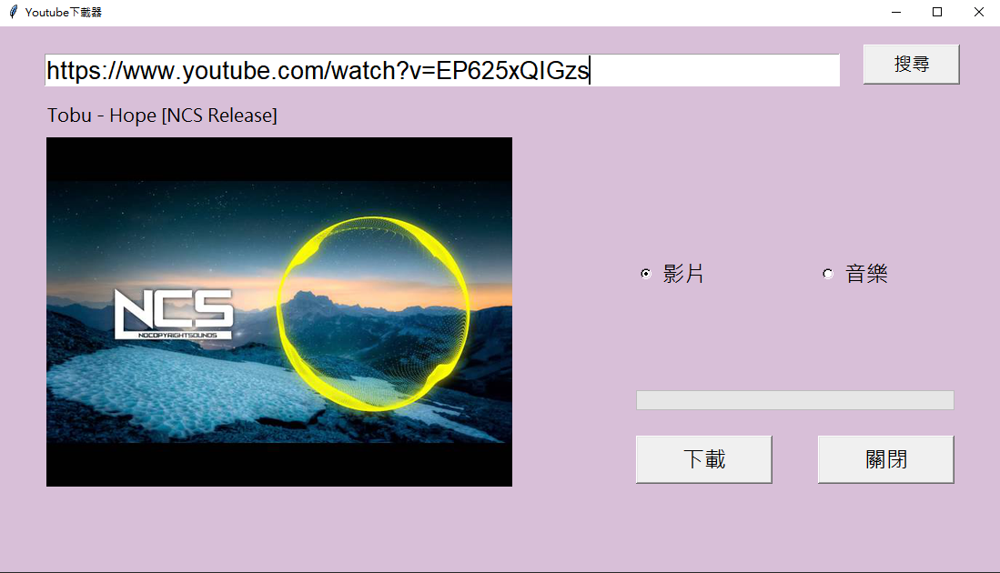
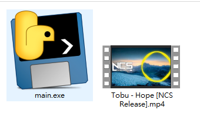

# utub
pytube GUI test

[pytube](https://github.com/pytube/pytube)

使用pytube的練習，方便抓取Youtube影片

## Use env
```
python == 3.6
pytube == 11.0.1
```

## Start

Download **dist** dict，execute **main.exe**  

Input youtube url and click **搜尋** button

If you want to download video select **影片** or you want download only audio files just select **音樂**

and click **下載** ， wait a few seconds ， Your video will be downloaded to the same directory as main.exe
## demo

### 程式畫面





